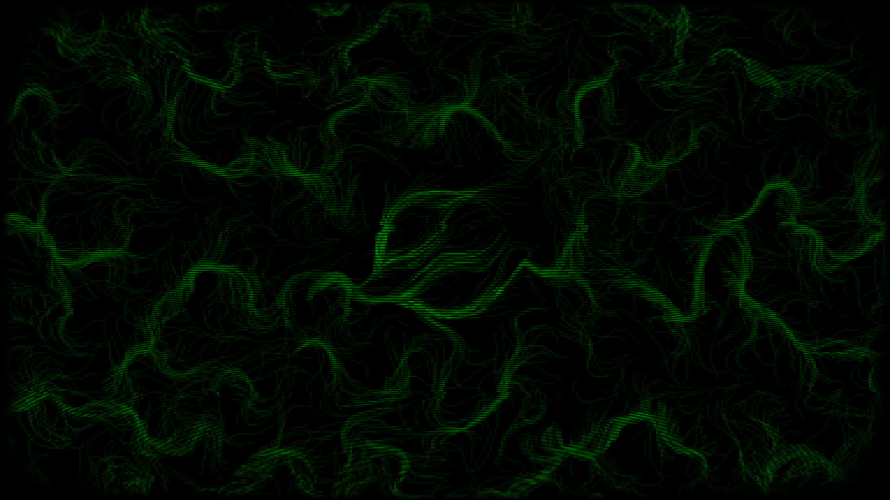
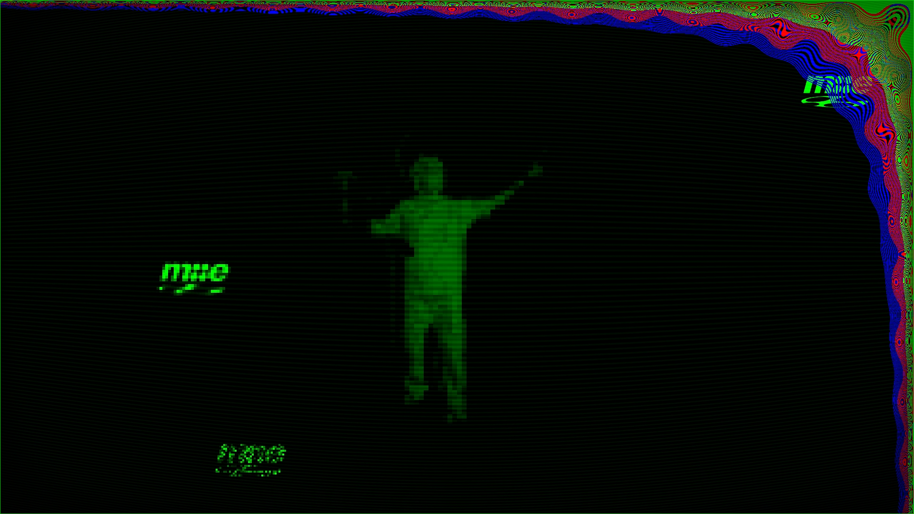

# Media Error Green

Media Error Green is part of an **interactive installation** developed
for [Blaue Nacht](https://www.nuernberg.de/internet/dieblauenacht/) 2025 in Nuremberg.

## Getting Started

### 1. Clone the repository

```sh
git clone https://github.com/UrAvgCode/media-error-green.git --recurse-submodules
```

### 2. Run the setup script

```sh
cd media-error-green/scripts
./setup.sh
```

## Screenshots

| Intro Screen                 | Tracking Screen                 |
|------------------------------|---------------------------------|
|  |  |
